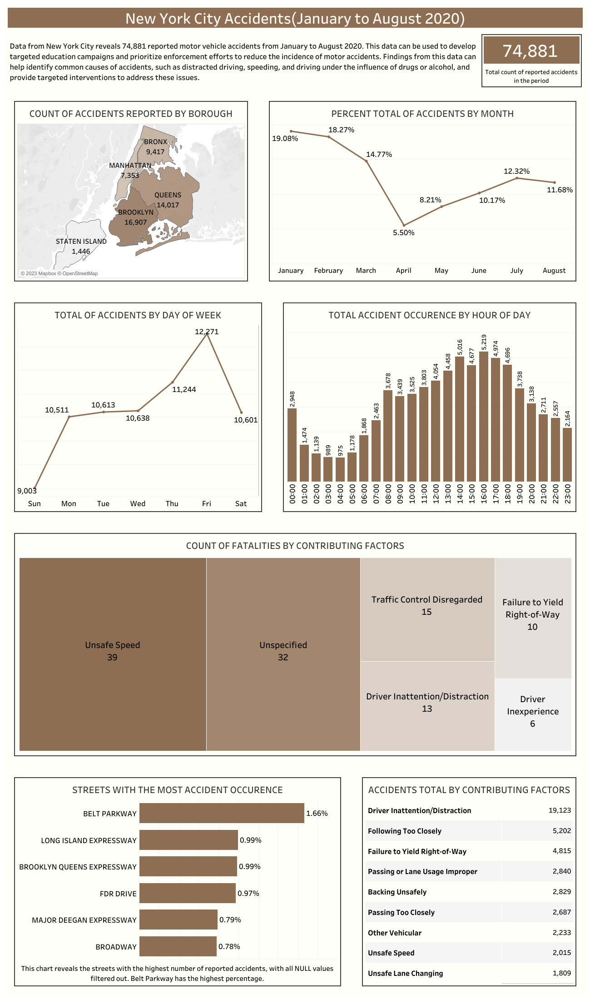

# NYC-Accidents-2020

> [Introduction](https://github.com/Afokoghene/NYC-Accidents-2020/#introduction) <br>
> [Problem Statement](https://github.com/Afokoghene/NYC-Accidents-2020/#problem-statement) <br>
> [Skills Demonstrated](https://github.com/Afokoghene/NYC-Accidents-2020/#skills-demonstrated) <br>
> [Data Sourcing](https://github.com/Afokoghene/NYC-Accidents-2020/#data-sourcing) <br>
> [Data Assessment and Transformation](https://github.com/Afokoghene/NYC-Accidents-2020/#data-assessment-and-transformation) <br>
> [Data Analysis](https://github.com/Afokoghene/NYC-Accidents-2020/#data-analysis) <br>
> [Data Visualization](https://github.com/Afokoghene/NYC-Accidents-2020/#data-visualization) <br>
> [Insights and Recommendations](https://github.com/Afokoghene/NYC-Accidents-2020/#insights_and_recommendations) <br>

## Introduction
After the completion of a few tutorials, I tasked myself with a project to put all that I have learned into practice and allow myself to get better as I work on this project.

Accidents occur almost every day and can occur anywhere. Data on past accidents can be analyzed and used to see trends of how accidents have occurred over time. With that known, preventive measures can be put in place regarding the factors causing these accidents.

The dataset I analyzed contains data on accidents reported from January to August of 2020 in New York City. The table has columns such as the accident/collision ID, street on which the accident occurred, time and date of each accident, zip code, borough, and a couple of other columns.

---

## Problem Statement
The problem is foused around how accidents occurred over the months reported, accident frequency by hour and day of the week, the most causative factor of accidents, and the streets on which the most accidents occurred. The problems are better broken down into questions as follows:
1. Compare the % of total accidents by month. Do you notice any seasonal patterns?
2. Break down accident frequency by day of week and hour of day. Based on this data, when do accidents occur most frequently?
3. On which particular street were the most accidents reported? What does that represent as a % of all reported accidents?
4. What was the most common contributing factor for the accidents reported in this sample (based on Vehicle 1)? What about fatal accidents specifically?

---

## Skills Demonstrated
- Cleaning, transformation of data to a useable structure and analysis of cleaned data using SQL.
- Visualization of data cleaned and analyzed data using Tableau.

---

## Data Sourcing
The dataset was obtained from [Maven Analytics' website](https://www.mavenanalytics.io/data-playground?accessType=open&dataStructure=5wfxyeVf1etbP4TXdyPdG1&page=2&pageSize=5) <br> where datasets are generally available for practice purposes.

---

## Data Assessment and Transformation
### Assessment
From the assessment of the data, I discovered it contained 74,881 rows and 29 columns. 
Below are the meanings of the columns that were used in this analysis
- Collision ID: This is the unique ID that each reported accident was assigned, it is the primary key as it is unique to each accident and its count is used to represent the total count of accidents reported in the smample.
- Time of Crash: This is the time at which each reported accident occurred and it is in the HH:MM format.
- Date of Crash: This is the date when the accident occured, it is in the YYYYMMDD format.
- On Street Name: This is the name of the street on which the accident occurred.
- Borough: This can be said to be the city / borough in which the reported accident occured.
- Zip Code: It is the zip / postal code associated with the street on which the accident was reported.
- Lattitude: This is the geographical lattitude(point) of the accident location.
- Longitude: This is the geographical lattitude(point) of the accident location.
- Contributing Factor Vehicle 1: This is the first / most signifacnt factor or cause of the reported accident.
### Transformation
The dataset was duplicated to first make sure that changes alterations were not made to theone an donly original dataset, as the original can be of help for reference purpose. The first access of the dataset and the duplication was done using Microsoft Excel. I took out the spacing between words in in the column headers for easy reference when usng SQL. 
After all of that, I imported the data into the SQLPractice database on Micrsoft SQL server and ran checks on each column to make sure there were in useable and the right formats.
I changed the converted the time column to useable format, created a new column for tiem and populated it with the converted one. The queries below was used for the purpose.
```sql
ALTER TABLE SQLPractice.dbo.NYCAccidents2020
ADD TimeOfCrash Time(3);

UPDATE SQLPractice.dbo.NYCAccidents2020
SET TimeOfCrash = CAST(CrashTime AS Time(3))
```
The date column was also converted to the right format using the queries below
```sql
ALTER TABLE SQLPractice.dbo.NYCAccidents2020
ADD DateOfCrash Date;

UPDATE SQLPractice.dbo.NYCAccidents2020
SET DateOfCrash = CAST(CrashDate AS Date)
```
I checked for the length of characters in the CollisionID column and noticed there were trailing and leading spaces and the dara type was also not in the right format so I changed the data type from float to integer and the spaces wrer trimmed automatically. The query below was used to this effect.
```sql
SELECT LEN(CollisionId)
FROM SQLPractice.dbo.NYCAccidents2020

ALTER TABLE SQLPractice.dbo.NYCAccidents2020 
ALTER COLUMN CollisionId INT;
```

---

## Data Analysis
After asseesing and transforming the data to formats that provide ease of usage and analysis, I moved on to analyze the data to answer the questions as stated in the problem statement.

1. Compare the % of total accidents by month. Do you notice any seasonal patterns?
```sql
SELECT DATENAME (month, DateOfCrash) MonthOfCrash, 
	   ROUND (COUNT(*) * 100.0 / SUM (COUNT(*)) OVER(), 2) AS MonthlyPercentage
FROM SQLPractice.dbo.NYCAccidents2020
GROUP BY DATENAME (month, DateOfCrash)
ORDER BY MonthlyPercentage DESC
```
| MonthOfCrash | MonthlyPercentage |
|------------------|-------------|
|    January    |   19.08   |
|    February    |   18.27   |
|    March    |   14.77   |
|    July    |   12.32    |
|    August    |  11.68    |
|    June    |   10.17   |
|    May    |   8.21   |
|    April    |   5.50   |

The query above was to show shows the month with the highest accident occurence and the table above is in descending order by the Monthly Percentage.

---

2. Break down accident frequency by day of week and hour of day. Based on this data, when do accidents occur most frequently?
- Weekday with most accident occurrence
```sql
SELECT DATENAME (weekday, DateOfCrash) DayOfCrash, COUNT (CollisionId) CollisionIdCount 
FROM SQLPractice.dbo.NYCAccidents2020
GROUP BY DATENAME (weekday, DateOfCrash)
ORDER BY COUNT (CollisionId) DESC
```
| DayOfCrash | CollisionIdCount |
|------------------|-------------|
|    Friday    |   12271  |
|    Thursday    |   11244   |
|    Wednesday    |   10638   |
|    Tuesday    |   10613   |
|    Saturday    |  10601    |
|    Monday    |   10511   |
|    Sunday    |   9003  |

  The above query shows the days of the week and count of collision Id(as stated earlier, this is a unique ID for each accident and its count is used to represent the total of accidents) per day. This is simply how many accidents occured in each weekday for the period reported in the sample and it is seen that accidents occur the most on Fridays. 

- Hour of the day with most accident occurrence
```sql
SELECT CONVERT (varchar(5), DATEPART (hour, TimeOfCrash)) + ':00' AS HourOfCrash,
       COUNT (CollisionId) AS CollisionIdCount
FROM SQLPractice.dbo.NYCAccidents2020
GROUP BY DATEPART (hour, TimeOfCrash)
ORDER BY CollisionIdCount DESC
```
| HourOfCrash | CollisionIdCount |
|------------------|-------------|
|    16:00    |   5219  |
|    14:00    |   5016   |
|    17:00    |   4974   |
|    18:00    |   4696   |
|    15:00    |  4677    |
|    13:00    |   4458   |
|    12:00    |   4054  |
|    11:00    |   3803  |
|    19:00    |   3738  |
|    08:00    |   3678  |
|    10:00    |   3525  |
|    09:00    |   3439  |
|    20:00    |   3138  |
|    00:00    |   2948  |
|    21:00    |   2711  |
|    22:00    |   2557  |
|    07:00    |   2463  |
|    23:00    |   2164  |
|    06:00    |   1868  |
|    01:00    |   1474  |
|    05:00    |   1178  |
|    02:00    |   1139  |
|    03:00    |   989  |
|    04:00    |   975  |

   The above query is used to pull the hour with the most accident occurence. The table shows hours of the day in one column and the total count of accidents on  the other column. Its result shows that accidents occurred the most in the hour of 16:00 PM. 

---

3. On which particular street were the most accidents reported? What does that represent as a % of all reported accidents?
- This query will select all street names including the streets recorded as **NULL** and also limit to the top 7
```sql
SELECT TOP 7 OnStreetName, 
	   ROUND (COUNT(*) * 100.0 / SUM (COUNT(*)) OVER(), 2) OnStreetNamePercentage
FROM SQLPractice.dbo.NYCAccidents2020
GROUP BY OnStreetName
ORDER BY OnStreetNamePercentage DESC
```
| OnStreetName | OnStreetNamePercentage |
|------------------|-------------|
|    NULL    |   25.96  |
|    BELT PARKWAY    |   1.66   |
|    BROOKLYN QUEENS EXPRESSWAY    |   0.99   |
|    LONG ISLAND EXPRESSWAY    |   0.99   |
|    FDR DRIVE   |  0.97    |
|    MAJOR DEEGAN EXPRESSWAY   |   0.79   |
|    GRAND CENTRAL PARKWAY   |   0.78  |

- This query will select all excluding the streets recorded as **NULL** and also limit to the top 6
```sql
SELECT TOP 6 OnStreetName, 
	   ROUND(COUNT(*) * 100.0 / SUM(COUNT(*)) OVER(), 2) OnStreetNamePercentage
FROM SQLPractice.dbo.NYCAccidents2020
WHERE OnStreetName IS NOT NULL
GROUP BY OnStreetName
ORDER BY OnStreetNamePercentage DESC
```
| OnStreetName | OnStreetNamePercentage |
|------------------|-------------|
|    BELT PARKWAY    |   2.25   |
|    BROOKLYN QUEENS EXPRESSWAY    |   1.34  |
|    LONG ISLAND EXPRESSWAY    |   1.33  |
|    FDR DRIVE   |  1.31    |
|    MAJOR DEEGAN EXPRESSWAY   |   1.07   |
|    GRAND CENTRAL PARKWAY   |   1.05  |

The above queries and tables shows that accidents occurred the most in Belt Parkway street during the period. 

---

4. What was the most common contributing factor for the accidents reported in this sample (based on Vehicle 1)? What about fatal accidents specifically?
   _Unspecified_ in the result is recorded just as it is and not returned as _NULL_. It is possible that the cause of those accidents were not specififed when 
   reported.
   
- This query will return the 10 most contributing factor to accidents as reported in the sample. 
```sql
SELECT TOP 10 ContributingFactorVehicle1, COUNT (CollisionId) CountCollisionId
FROM SQLPractice.dbo.NYCAccidents2020
GROUP BY ContributingFactorVehicle1
ORDER BY CountCollisionId DESC
```
| ContributingFactorVehicle1 | CountCollisionId |
|------------------|-------------|
|    Unspecified    |   19471  |
|    Driver Inattention/Distraction    |   19123  |
|    Following Too Closely    |   5202   |
|    Failure to Yield Right-of-Way   |   4815  |
|    Passing or Lane Usage Improper   |  2840    |
|    Backing Unsafely   |   2829   |
|    Passing Too Closely   |   2687  |
|    Other Vehicular   |   2233  |
|    Unsafe Speed   |   2015  |
|    Unsafe Lane Changing   |   1809  |

- This query will return the 6 most contributing factor to accidents that had fatalities(led to deaths).
```sql
SELECT TOP 6 ContributingFactorVehicle1, COUNT(CollisionId) CountCollisionId
FROM SQLPractice.dbo.NYCAccidents2020
WHERE NumberOfPersonsKilled > 0
GROUP BY ContributingFactorVehicle1
ORDER BY CountCollisionId DESC
```
| ContributingFactorVehicle1 | CountCollisionId |
|------------------|-------------|
|    Unsafe Speed    |   33  |
|    Unspecified    |   32  |
|    Traffic Control Disregarded   |   15   |
|    Driver Inattention/Distraction   |   13  |
|    Failure to Yield Right-of-Way   |  10    |
|    Pedestrian/Bicyclist/Other Pedestrian Error/Confusion   |   6   |

---

## Data Visualization

This data visualization was created using Tableau desktop, each visual in it is created to display information matching each question in the problem statement.



Check out the live dashboard [here](https://public.tableau.com/app/profile/afokoghene.osiobe.arierhi/viz/NYCAccidents2020-N/NewYorkCityAccidentsJanuarytoAugust2020?publish=yes) <br>

---

## Insights and Recommendations
### Insights


### Recommendations


